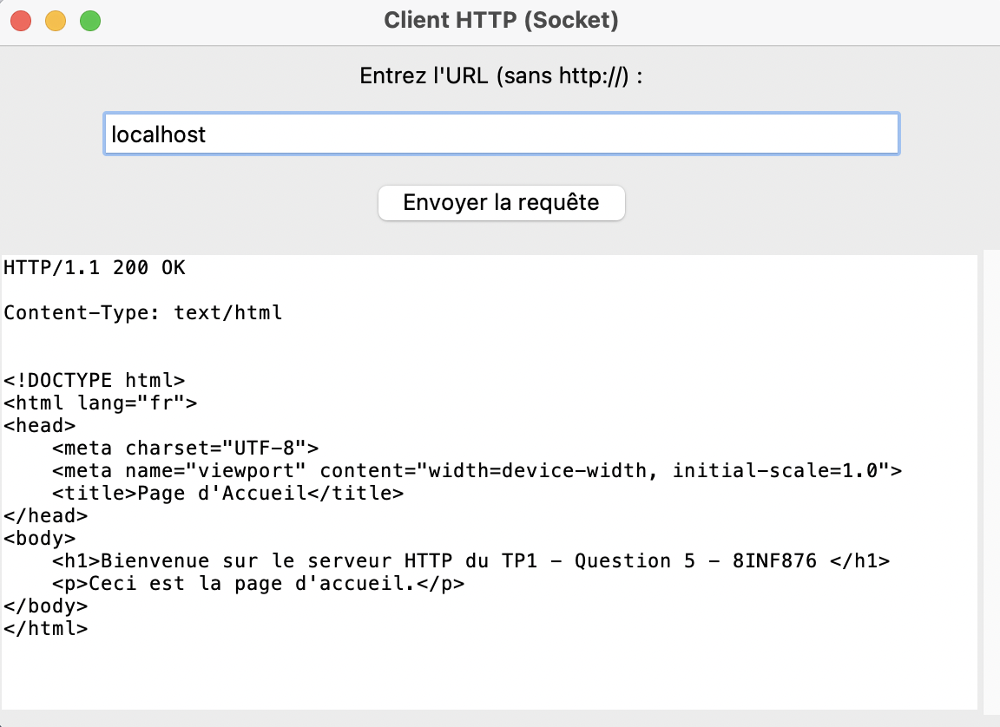

# http-client-server

Ce projet met en œuvre un client et un serveur HTTP simples en utilisant la bibliothèque socket de Python. 

Le client permet d'envoyer des requêtes HTTP à un serveur, et le serveur répond en fonction des fichiers présents dans son répertoire.
Par défaut, le serveur renvoie index.html, un fichier d'exemple fournit.

## Installation

Pour utiliser ce projet, assurez-vous d'avoir Python installé sur votre machine.

Ensuite, vous pouvez cloner le répertoire github avec la commande suivante :

```
git clone https://github.com/antoinesesini/http-client-server
cd http-client-server
```


Ensuite, vous pouvez lancer le serveur avec :

```
python server.py
```

Puis, ouvrez un autre terminal pour exécuter le client :

```
python client.py
```


## Client

### Utilisation

Le client se lance dans une interface graphique où l'utilisateur peut entrer l'URL d'un serveur (sans `http://`). 
En cliquant sur le bouton pour envoyer la requête, le client établit une connexion avec le serveur et affiche la réponse reçue.

### Exemple

Après avoir lancé le serveur, si le client est lancé avec la saisie `localhost`, voici le résultat :




## Serveur

### Utilisation

Le serveur écoute par défaut sur le port 80. 
Lorsqu'il reçoit une requête HTTP, il traite la demande et renvoie le contenu du fichier demandé (par défaut index.html si "/" est demandé). 
Si le fichier n'est pas trouvé, il retourne une page d'erreur 404.

Le fichier servi est index.html, vous pouvez le modifier à votre guise.